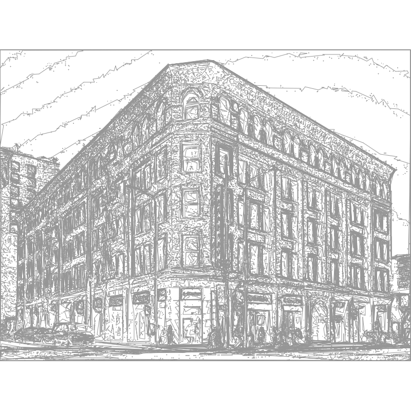

# Line Drawing Studio

A browser-based application that converts photographs into stylized line drawings using contour detection, line optimization, and vector rendering. Designed for pen plotters and digital art. All processing runs client-side — no server required.

**Fully responsive** — works on desktop, tablet, and mobile.

## Example Output

**Portrait** — contour lines with Catmull-Rom smoothing on paper texture:

.png)

**Architecture** — Bradbury Building rendered with brightness threshold detection:



## Getting Started

### Prerequisites

A modern web browser with WebGL support (Chrome, Firefox, Edge, Safari).

### Running the App

1. Clone the repository:
   ```bash
   git clone https://github.com/adworetzky/Line-Drawing.git
   cd Line-Drawing
   ```

2. Serve the files with any static HTTP server:
   ```bash
   # Python
   python3 -m http.server 8000

   # Node.js (npx)
   npx serve .

   # VS Code — use the "Live Server" extension
   ```

3. Open `http://localhost:8000` in your browser.

> **Note:** Opening `index.html` directly via `file://` will not work due to browser CORS restrictions on the OpenCV WASM module.

### Basic Workflow

1. **Load an image** — Drag and drop onto the source panel, or click to browse.
2. **Pick a preset** — Choose Sketch, Technical, Hatched, Minimal, or Bold from the dropdown at the top of the sidebar, or dial in your own settings.
3. **Generate** — Click the **Generate** button (or enable **Auto** to regenerate on every parameter change).
4. **Edit** — Use the toolbar to select, move, or erase individual paths.
5. **Export** — Save as PNG or SVG using the buttons in the top-right corner.

## Features

### Presets

Five built-in parameter presets for quick starting points:

| Preset | Description |
|--------|-------------|
| **Sketch** | Loose, hand-drawn feel with moderate simplification and light weight variation |
| **Technical** | Dense, precise contours using Canny edge detection with no smoothing |
| **Hatched** | Contour lines plus cross-hatching for tonal shading |
| **Minimal** | Just a few contour levels with heavy simplification for clean output |
| **Bold** | Many levels with thick, weight-varied strokes for dramatic results |

Selecting any preset populates all controls. Changing any control afterward switches the preset dropdown back to "Custom".

### Image Processing

| Feature | Description |
|---------|-------------|
| **Brightness Threshold** | Generates iso-brightness contour lines at multiple levels |
| **Canny Edge Detection** | Uses OpenCV's Canny algorithm for sharp edge detection |
| **Adaptive Threshold** | Applies locally adaptive thresholding for uneven lighting |
| **GPU Acceleration** | WebGL shaders handle grayscale conversion, thresholding, Sobel edge detection, and Gaussian blur on the GPU. Falls back to CPU automatically if WebGL is unavailable. |

### Cross-Hatching

Optional brightness-adaptive hatching for tonal shading (ideal for pen plotters):

- **Parallel** — Single-direction hatch lines
- **Cross-hatch** — Two perpendicular passes; the second pass only activates in darker areas
- **Triple-hatch** — Three passes at 60° offsets; each successive pass targets progressively darker tones

Controls: line spacing (3–24 px), angle (0–175°), and brightness cutoff (40–240).

### Line Optimization

Three simplification algorithms to control output complexity:

- **Ramer-Douglas-Peucker** — Classic recursive simplification that removes points deviating less than a tolerance from a line segment. Good general-purpose choice.
- **Visvalingam-Whyatt** — Area-based simplification that removes points contributing the least triangle area. Produces smoother results on organic shapes.
- **Radial Distance** — Fast distance-based filtering that collapses nearby points. Best for reducing density without altering overall shape.

Adjustable tolerance controls how aggressively points are removed (0 = no simplification, 20 = maximum).

### Smoothing

Four smoothing modes applied after simplification via Paper.js:

- **Catmull-Rom** — Spline interpolation that passes through all control points. Adjustable tension from -1 to 1.
- **Geometric** — Smoothing based on geometric relationships between segments.
- **Continuous** — Ensures continuous curvature across the path.
- **None (Angular)** — Keeps simplified points as-is with straight segments.

### Style & Weight Variation

- **Stroke width** — 0.1 px to 5 px
- **Stroke color** — Any color via the color picker
- **Weight variation** — 0 to 3x. Varies stroke width per path based on the brightness of the underlying image: darker areas produce thicker strokes, lighter areas stay thin. Set to 0 for uniform width.
- **Background** — Paper texture, white, transparent, or a custom color

### Output Dimensions & Margins

- **Paper presets** — Letter, Tabloid, A4, A3, square formats, and custom sizes up to 48 inches
- **DPI** — 72 (preview), 96 (screen), 150 (draft), 300 (print)
- **Orientation** — Portrait / Landscape toggle swaps width and height
- **Margin** — 0 to 2 inches of inset margin. The image is drawn within the margin boundary, leaving a clean border for plotter safe areas and framing.

### Auto-Generate

Enable the **Auto** checkbox next to the Generate button to automatically regenerate the drawing whenever any parameter changes (debounced at 600 ms). Useful for live-tuning settings.

### Interactive Editor

| Tool | Shortcut | Description |
|------|----------|-------------|
| **Select** | `V` | Click to select paths. Drag to move them. Press `Delete` to remove. |
| **Pan** | `H` | Click and drag to pan the canvas view. |
| **Eraser** | `E` | Click or drag over paths to delete them. |
| **Undo** | `Ctrl+Z` | Revert the last editing action (up to 50 steps). |
| **Redo** | `Ctrl+Y` | Reapply a reverted action. |
| **Zoom In** | `+` | Zoom into the canvas. |
| **Zoom Out** | `-` | Zoom out of the canvas. |
| **Fit to View** | `0` | Reset zoom to fit the drawing in the viewport. |

### Pen Plotter Statistics

After generating, the Statistics panel shows:

| Stat | Description |
|------|-------------|
| **Est. Plot Time** | Estimated plotting duration based on drawing speed (40 mm/s), travel speed (150 mm/s), and pen-lift time (0.2 s) |
| **Draw Distance** | Total pen-down path length in metres |
| **Travel Distance** | Total pen-up movement between paths in metres |
| **Pen Lifts** | Number of pen up/down cycles |

Paths are sorted using greedy nearest-neighbor within each group to minimize travel distance.

### Layer Management

Each contour threshold level (and hatching, if enabled) is rendered as a separate layer. The right sidebar shows all layers with:

- Visibility toggles (click the circle icon to show/hide a level)
- Selection highlighting
- Live statistics

### Export

- **PNG** — Rasterized export at full canvas resolution with a timestamped filename.
- **SVG** — Vector export with physical dimensions (inches) embedded so pen plotters interpret real-world size. Uses Blob URLs for reliable large-file downloads.

## Responsive Design

The app adapts to different screen sizes:

| Breakpoint | Behavior |
|------------|----------|
| **> 1100 px** | Full three-column layout: left sidebar, canvas, right sidebar |
| **768–1100 px** | Two-column: left sidebar + canvas. Right sidebar hidden. |
| **< 768 px** | Mobile: sidebars collapse into a slide-out drawer toggled by the hamburger menu. Touch-friendly controls. Generate button in the toolbar. |
| **< 480 px** | Full-width drawer. Title hidden. Only SVG export shown. |

## Project Structure

```
Line-Drawing/
├── index.html            # Application layout
├── styles.css            # Dark-themed responsive UI styles
├── js/
│   ├── script.js         # Main application controller
│   ├── LineRender.js     # Processing pipeline (contours, hatching, simplification, rendering)
│   ├── editor.js         # Interactive editing tools and undo/redo
│   ├── gpu.js            # WebGL shader-based GPU processing
│   ├── simplify.js       # Ramer-Douglas-Peucker algorithm (third-party)
│   └── opencv.js         # OpenCV.js WASM module
├── assets/               # Sample images and paper texture
└── output/               # Example output images
```

## Technology Stack

- **[Paper.js](http://paperjs.org/)** — Vector graphics rendering and SVG export
- **[OpenCV.js](https://docs.opencv.org/4.x/d5/d10/tutorial_js_root.html)** — Image processing and contour detection (compiled to WebAssembly)
- **[Simplify.js](https://mourner.github.io/simplify-js/)** — High-performance polyline simplification
- **WebGL** — GPU-accelerated image processing via custom GLSL shaders
- **Vanilla JS/HTML/CSS** — No build tools or frameworks required

## Browser Support

| Browser | Status |
|---------|--------|
| Chrome 90+ | Fully supported |
| Firefox 90+ | Fully supported |
| Edge 90+ | Fully supported |
| Safari 15+ | Supported (WebGL may vary) |
| Mobile Chrome/Safari | Supported (responsive layout) |

## License

This project is provided as-is for educational and personal use.
